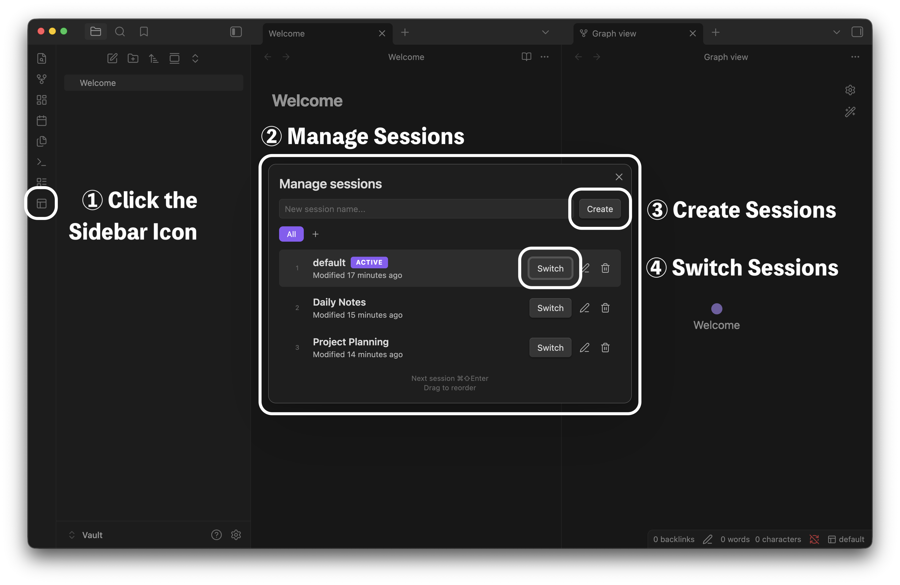
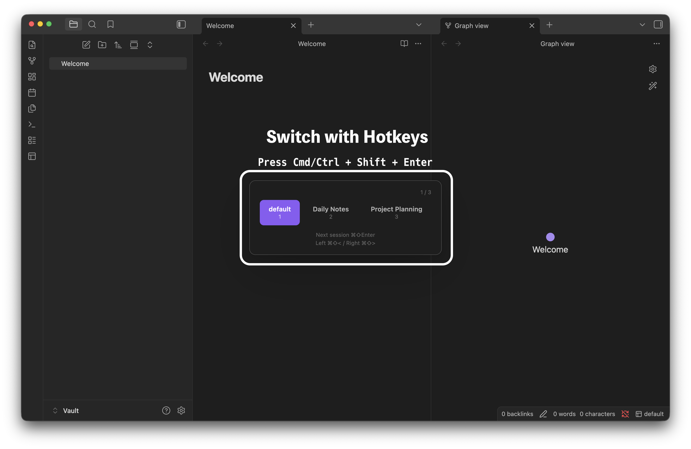
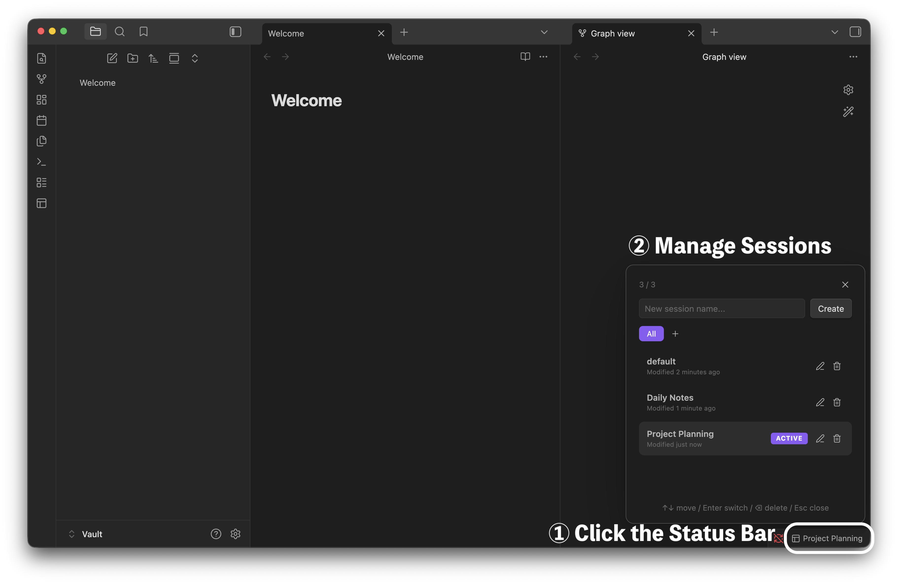

# Workspace++

Workspace++ is an [Obsidian](https://obsidian.md/) community plugin for saving, switching, and organizing workspace sessions. It is built for people who want Obsidian layouts to feel fast, native, and keyboard-friendly.



## Highlights

- Save the current workspace layout as a named session.
- Switch sessions from the status bar, quick switcher, command palette, hotkeys, or session manager.
- Use automatic save-on-switch, or turn it off for a manual save workflow.
- Organize sessions into groups.
- Customize status bar click, middle-click, right-click, and modified-click actions.
- Scroll on the status bar to switch sessions.
- See a status bar warning when a manual-save session has unsaved layout changes.
- Save, reload, duplicate, rename, delete, reorder, and bulk-delete sessions.
- Keep per-session version history and restore previous layouts.
- Export, import, and restore session backups.
- Load sessions from note frontmatter with `workspace-session`.
- Save the current note name as a session and write the matching frontmatter automatically.
- Use Workspace++ in 21 interface locales.

## Features

### Quick switching

Cycle through sessions with `Cmd/Ctrl+Shift+Enter`, or move backward/forward with `Cmd/Ctrl+Shift+,` and `Cmd/Ctrl+Shift+.`. You can also register numbered or name-based session switch commands for custom hotkeys.



### Session manager

Open the session manager to switch, create, rename, duplicate, delete, reorder, bulk-delete, and group sessions.



### Create, duplicate, delete

Create sessions from the current layout, duplicate the active session with `Cmd/Ctrl+Shift+M`, or delete it with `Cmd/Ctrl+Shift+Backspace`.

### Rename and reorder

Rename the current session with `Cmd/Ctrl+Shift+R`, right-click sessions for context actions, and drag sessions to reorder them.

### Status bar workflow

The status bar shows the active group and session. By default, click opens the quick switcher, `Cmd/Ctrl+Click` saves the current session, right-click opens the session menu, and `Cmd/Ctrl+Right-click` restores the latest version history entry.

You can customize status bar click actions in settings, including save, save as, reload without saving, rename, duplicate, previous/next session, blank session, version history, and "save current note name as session".

### Save modes

Workspace++ defaults to automatic save-on-switch. If you prefer a manual workflow, turn auto-save off and use explicit save/reload commands. In manual mode, Workspace++ can warn before switching away from unsaved layout changes and highlight the status bar when the current layout differs from the saved session.

Manual-save tools include:

- Save current session.
- Save current session as a new session.
- Save the current layout to another existing session.
- Reload the current session without saving local layout changes.

### Session groups

Groups let you organize sessions without deleting or duplicating them. You can switch groups, show all sessions, move sessions between groups, remove sessions from groups, and disable the group feature if you do not need it.

### Version history and backups

Workspace++ keeps per-session version history for layout changes and can restore previous layouts. It also keeps session backup files in the vault and supports manual export/import snapshots from settings or commands.

Automatic rotation backups are created on save, hourly, up to 3 generations.

### Frontmatter sessions

Add this property to a note to load a session when that note is opened:

```yaml
workspace-session: My Session
```

Workspace++ also provides a command, **Save current note name as session**, that writes `workspace-session: <note-name>` to the current Markdown note and creates or overwrites the matching session using the current layout.

## Installation

### From Community Plugins

1. Open Obsidian **Settings** > **Community plugins**.
2. Click **Browse** and search for **Workspace++**.
3. Click **Install**, then **Enable**.

Community plugin page:

https://community.obsidian.md/plugins/workspace-plus-plus

### From release

1. Download `main.js`, `manifest.json`, and `styles.css` from the [latest release](https://github.com/s1m4ne/obsidian-workspace-plus/releases/latest).
2. Create a folder at `<your-vault>/.obsidian/plugins/workspace-plus-plus/`.
3. Place the three files into that folder.
4. Open Obsidian **Settings** > **Community plugins** and enable **Workspace++**.

### With BRAT

Use BRAT if you want to test unreleased changes directly from GitHub.

1. Install the [BRAT](https://github.com/TfTHacker/obsidian42-brat) plugin.
2. Open **Settings** > **BRAT** > **Add Beta plugin**.
3. Paste this URL and click **Add Plugin**:

```text
https://github.com/s1m4ne/obsidian-workspace-plus
```

## Commands

All commands can be assigned custom hotkeys in **Settings** > **Hotkeys**.

Some commands follow a setting and are hidden when it is off: the group
commands need **Session groups**, and **Search sessions** needs **Show session
filter**.

| Command | Default hotkey |
| --- | --- |
| Manage sessions | - |
| Create new session | - |
| Create blank session | - |
| Duplicate current session | `Cmd/Ctrl+Shift+M` |
| Rename current session | `Cmd/Ctrl+Shift+R` |
| Delete current session | `Cmd/Ctrl+Shift+Backspace` |
| Previous session | `Cmd/Ctrl+Shift+,` |
| Next session | `Cmd/Ctrl+Shift+Enter`, `Cmd/Ctrl+Shift+.` |
| Switch to session 1-9 | Assignable |
| Save current session | `Cmd/Ctrl+Shift+S` |
| Save current session as... | - |
| Save current note name as session | - |
| Save current layout to session... | - |
| Reload current session (without saving) | - |
| Toggle auto-save on switch | - |
| Enable auto-save on switch | - |
| Disable auto-save on switch | - |
| Search sessions | - |
| View session version history | - |
| Export sessions snapshot | - |
| Import latest sessions snapshot | - |
| Switch group | - |
| Show all sessions (exit group) | - |
| Next group | `Cmd/Ctrl+Shift+Tab`, `Cmd/Ctrl+Shift+G` |
| Previous group | - |

## Sync and storage

Sessions and settings are stored together in the plugin's data file:

```text
.obsidian/plugins/workspace-plus-plus/data.json
```

This is deliberate. Obsidian Sync only carries four files out of a plugin folder -- `manifest.json`, `main.js`, `styles.css` and `data.json` -- so `data.json` is the only place sessions can live and still reach your other devices. For that to happen, **Installed community plugins** has to be enabled in your Obsidian Sync settings.

Version history and backups stay on the device that made them:

```text
sessions.backup.json
history.json
backups/
```

Version history holds snapshots of workspace layouts, and layouts are device-specific -- restoring another machine's snapshot would reproduce the very breakage it is there to undo. Keeping it local also keeps `data.json` small, which matters because Sync skips files over its per-file size limit.

### Keeping sessions in one vault

If you share `.obsidian` across several vaults, for example with Settings Profiles, every vault sees the same `data.json` and therefore the same sessions. Turn on **Keep sessions in this vault only** in **Settings** > **Workspace++** > **Advanced** to store them here instead:

```text
.workspace-plus-plus/sessions.json
```

Each vault then keeps its own sessions. Obsidian Sync cannot carry that file -- it excludes dot-folders -- so this trades device sync for vault separation. Third-party tools that sync the whole vault, such as Syncthing, still work.

### Concurrent edits

Workspace++ watches the session store and merges external changes when it can, but this is not a conflict-free merge system. If you use Obsidian Sync, Syncthing, Dropbox, iCloud, or another sync tool, let sync finish before editing sessions on another device. Backups help recover from corrupted session data; they do not resolve simultaneous edits.

## Languages

Workspace++ includes 21 interface locales:

English, Arabic, Bengali, Chinese Simplified, Chinese Traditional, French, German, Hindi, Indonesian, Italian, Japanese, Korean, Malay, Persian, Polish, Portuguese, Russian, Spanish, Thai, Turkish, and Vietnamese.

## Video Demos

<details>
<summary>Show video demos</summary>

### Quick switching

https://github.com/user-attachments/assets/b1dc94f7-b979-4b09-97e6-3ebf4837b5ed

### Session manager

https://github.com/user-attachments/assets/27a02a7b-aaa8-4795-b67d-4348fa4012f7

### Create, duplicate, delete

https://github.com/user-attachments/assets/c86b8000-c49e-442c-8246-17c181a4d921

### Rename and reorder

https://github.com/user-attachments/assets/6041d80f-9c15-4a59-8d27-8a8f39d9dba6

https://github.com/user-attachments/assets/6c2b5a13-cc9f-43ca-bff1-944c5b318a92

</details>

## Community

Bug reports, feature requests, and pull requests are welcome. Feel free to open an [issue](https://github.com/s1m4ne/obsidian-workspace-plus/issues) or PR.

If you find this plugin useful, please give it a star on GitHub. It helps others discover it.

## License

MIT
